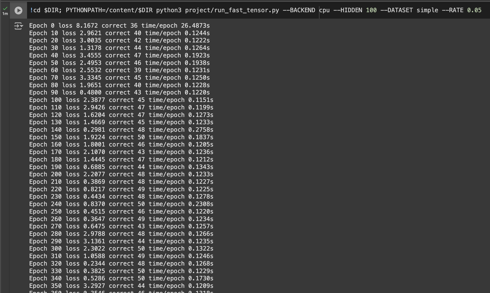

# MiniTorch Module 3


* Docs: https://minitorch.github.io/

* Overview: https://minitorch.github.io/module3.html


You will need to modify `tensor_functions.py` slightly in this assignment.

* Tests:

```
python run_tests.py
```

* Note:

Several of the tests for this assignment will only run if you are on a GPU machine and will not
run on github's test infrastructure. Please follow the instructions to setup up a colab machine
to run these tests.

This assignment requires the following files from the previous assignments. You can get these by running

```bash
python sync_previous_module.py previous-module-dir current-module-dir
```

The files that will be synced are:

        minitorch/tensor_data.py minitorch/tensor_functions.py minitorch/tensor_ops.py minitorch/operators.py minitorch/scalar.py minitorch/scalar_functions.py minitorch/module.py minitorch/autodiff.py minitorch/module.py project/run_manual.py project/run_scalar.py project/run_tensor.py minitorch/operators.py minitorch/module.py minitorch/autodiff.py minitorch/tensor.py minitorch/datasets.py minitorch/testing.py minitorch/optim.py

(.venv) camiletong@CamiledeMacBook-Pro mod3-CamileTong % python project/parallel_check.py
MAP

================================================================================
 Parallel Accelerator Optimizing:  Function tensor_map.<locals>._map,
/Users/camiletong/workspace/mod3-CamileTong/minitorch/fast_ops.py (163)
================================================================================


Parallel loop listing for  Function tensor_map.<locals>._map, /Users/camiletong/workspace/mod3-CamileTong/minitorch/fast_ops.py (163)
-----------------------------------------------------------------------------|loop #ID
    def _map(                                                                |
        out: Storage,                                                        |
        out_shape: Shape,                                                    |
        out_strides: Strides,                                                |
        in_storage: Storage,                                                 |
        in_shape: Shape,                                                     |
        in_strides: Strides,                                                 |
    ) -> None:                                                               |
        # TODO: 3.1                                                          |
        is_aligned = (                                                       |
            np.array_equal(out_shape, in_shape) and                          |
            np.array_equal(out_strides, in_strides)                          |
        )                                                                    |
                                                                             |
        # Fast path                                                          |
        if is_aligned:                                                       |
            for i in prange(len(out)):---------------------------------------| #0
                out[i] = fn(in_storage[i])                                   |
        # Slow path                                                          |
        else:                                                                |
            out_index = np.empty(MAX_DIMS, np.int32)                         |
            in_index = np.empty(MAX_DIMS, np.int32)                          |
                                                                             |
            for i in prange(len(out)):---------------------------------------| #1
                to_index(i, out_shape, out_index)                            |
                # broadcasting                                               |
                broadcast_index(out_index, out_shape, in_shape, in_index)    |
                out_pos = index_to_position(out_index, out_strides)          |
                in_pos = index_to_position(in_index, in_strides)             |
                out[out_pos] = fn(in_storage[in_pos])                        |
--------------------------------- Fusing loops ---------------------------------
Attempting fusion of parallel loops (combines loops with similar properties)...
Following the attempted fusion of parallel for-loops there are 2 parallel for-
loop(s) (originating from loops labelled: #0, #1).
--------------------------------------------------------------------------------
----------------------------- Before Optimisation ------------------------------
--------------------------------------------------------------------------------
------------------------------ After Optimisation ------------------------------
Parallel structure is already optimal.
--------------------------------------------------------------------------------
--------------------------------------------------------------------------------

---------------------------Loop invariant code motion---------------------------
Allocation hoisting:
No allocation hoisting found
None
ZIP

================================================================================
 Parallel Accelerator Optimizing:  Function tensor_zip.<locals>._zip,
/Users/camiletong/workspace/mod3-CamileTong/minitorch/fast_ops.py (220)
================================================================================


Parallel loop listing for  Function tensor_zip.<locals>._zip, /Users/camiletong/workspace/mod3-CamileTong/minitorch/fast_ops.py (220)
-----------------------------------------------------------------------------------------------------------|loop #ID
    def _zip(                                                                                              |
        out: Storage,                                                                                      |
        out_shape: Shape,                                                                                  |
        out_strides: Strides,                                                                              |
        a_storage: Storage,                                                                                |
        a_shape: Shape,                                                                                    |
        a_strides: Strides,                                                                                |
        b_storage: Storage,                                                                                |
        b_shape: Shape,                                                                                    |
        b_strides: Strides,                                                                                |
    ) -> None:                                                                                             |
        # TODO: 3.1                                                                                        |
        is_aligned = (                                                                                     |
            np.array_equal(out_shape, a_shape) and                                                         |
            np.array_equal(out_shape, b_shape) and                                                         |
            np.array_equal(out_strides, a_strides) and                                                     |
            np.array_equal(out_strides, b_strides)                                                         |
        )                                                                                                  |
                                                                                                           |
        # Fast path - when tensors are aligned                                                             |
        if is_aligned:                                                                                     |
            for i in prange(len(out)):---------------------------------------------------------------------| #2
                out[i] = fn(float(a_storage[i]), float(b_storage[i]))  # Convert to float                  |
        # Slow path - handle broadcasting                                                                  |
        else:                                                                                              |
            out_index = np.empty(MAX_DIMS, np.int32)                                                       |
            a_index = np.empty(MAX_DIMS, np.int32)                                                         |
            b_index = np.empty(MAX_DIMS, np.int32)                                                         |
                                                                                                           |
            for i in prange(len(out)):---------------------------------------------------------------------| #3
                to_index(i, out_shape, out_index)                                                          |
                broadcast_index(out_index, out_shape, a_shape, a_index)                                    |
                broadcast_index(out_index, out_shape, b_shape, b_index)                                    |
                out_pos = index_to_position(out_index, out_strides)                                        |
                a_pos = index_to_position(a_index, a_strides)                                              |
                b_pos = index_to_position(b_index, b_strides)                                              |
                out[out_pos] = fn(float(a_storage[a_pos]), float(b_storage[b_pos]))  # Convert to float    |
--------------------------------- Fusing loops ---------------------------------
Attempting fusion of parallel loops (combines loops with similar properties)...
Following the attempted fusion of parallel for-loops there are 2 parallel for-
loop(s) (originating from loops labelled: #2, #3).
--------------------------------------------------------------------------------
----------------------------- Before Optimisation ------------------------------
--------------------------------------------------------------------------------
------------------------------ After Optimisation ------------------------------
Parallel structure is already optimal.
--------------------------------------------------------------------------------
--------------------------------------------------------------------------------

---------------------------Loop invariant code motion---------------------------
Allocation hoisting:
No allocation hoisting found
None
REDUCE

================================================================================
 Parallel Accelerator Optimizing:  Function tensor_reduce.<locals>._reduce,
/Users/camiletong/workspace/mod3-CamileTong/minitorch/fast_ops.py (282)
================================================================================


Parallel loop listing for  Function tensor_reduce.<locals>._reduce, /Users/camiletong/workspace/mod3-CamileTong/minitorch/fast_ops.py (282)
-------------------------------------------------------------------|loop #ID
    def _reduce(                                                   |
        out: Storage,                                              |
        out_shape: Shape,                                          |
        out_strides: Strides,                                      |
        a_storage: Storage,                                        |
        a_shape: Shape,                                            |
        a_strides: Strides,                                        |
        reduce_dim: int,                                           |
    ) -> None:                                                     |
        reduce_size = a_shape[reduce_dim]                          |
        reduce_stride = a_strides[reduce_dim]                      |
                                                                   |
        # Process each output position in parallel                 |
        for i in prange(len(out)):---------------------------------| #4
            out_index = np.empty(MAX_DIMS, np.int32)               |
            to_index(i, out_shape, out_index)                      |
                                                                   |
            # Get positions                                        |
            out_pos = index_to_position(out_index, out_strides)    |
            a_pos = index_to_position(out_index, a_strides)        |
            acc = out[out_pos]                                     |
                                                                   |
            for _ in range(reduce_size):                           |
                acc = fn(acc, a_storage[a_pos])                    |
                a_pos += reduce_stride                             |
                                                                   |
            out[out_pos] = acc                                     |
--------------------------------- Fusing loops ---------------------------------
Attempting fusion of parallel loops (combines loops with similar properties)...
Following the attempted fusion of parallel for-loops there are 1 parallel for-
loop(s) (originating from loops labelled: #4).
--------------------------------------------------------------------------------
----------------------------- Before Optimisation ------------------------------
--------------------------------------------------------------------------------
------------------------------ After Optimisation ------------------------------
Parallel structure is already optimal.
--------------------------------------------------------------------------------
--------------------------------------------------------------------------------

---------------------------Loop invariant code motion---------------------------
Allocation hoisting:
The memory allocation derived from the instruction at
/Users/camiletong/workspace/mod3-CamileTong/minitorch/fast_ops.py (296) is
hoisted out of the parallel loop labelled #4 (it will be performed before the
loop is executed and reused inside the loop):
   Allocation:: out_index = np.empty(MAX_DIMS, np.int32)
    - numpy.empty() is used for the allocation.
None
MATRIX MULTIPLY

================================================================================
 Parallel Accelerator Optimizing:  Function _tensor_matrix_multiply,
/Users/camiletong/workspace/mod3-CamileTong/minitorch/fast_ops.py (313)
================================================================================


Parallel loop listing for  Function _tensor_matrix_multiply, /Users/camiletong/workspace/mod3-CamileTong/minitorch/fast_ops.py (313)
----------------------------------------------------------------------------------------------|loop #ID
def _tensor_matrix_multiply(                                                                  |
    out: Storage,                                                                             |
    out_shape: Shape,                                                                         |
    out_strides: Strides,                                                                     |
    a_storage: Storage,                                                                       |
    a_shape: Shape,                                                                           |
    a_strides: Strides,                                                                       |
    b_storage: Storage,                                                                       |
    b_shape: Shape,                                                                           |
    b_strides: Strides,                                                                       |
) -> None:                                                                                    |
    # Handle batch dimension strides                                                          |
    a_batch_stride = a_strides[0] if a_shape[0] > 1 else 0                                    |
    b_batch_stride = b_strides[0] if b_shape[0] > 1 else 0                                    |
    # TODO: Implement for Task 3.2.                                                           |
                                                                                              |
    # Get matrix dimensions                                                                   |
    batch_size = out_shape[0]  # Number of matrices in batch                                  |
    rows = a_shape[-2]         # Number of rows in output                                     |
    cols = b_shape[-1]         # Number of columns in output                                  |
    reduce_dim = a_shape[-1]   # Dimension to sum over (a's cols = b's rows)                  |
                                                                                              |
    # Main matrix multiplication loop                                                         |
    for batch in prange(batch_size):----------------------------------------------------------| #7
        for row in prange(rows):--------------------------------------------------------------| #6
            for col in prange(cols):----------------------------------------------------------| #5
                # Calculate position in output tensor                                         |
                out_pos = (                                                                   |
                    batch * out_strides[0] +                                                  |
                    row * out_strides[1] +                                                    |
                    col * out_strides[2]                                                      |
                )                                                                             |
                                                                                              |
                # Compute dot product                                                         |
                acc = 0.0                                                                     |
                for k in range(reduce_dim):                                                   |
                    # Get positions in input tensors                                          |
                    a_pos = batch * a_batch_stride + row * a_strides[1] + k * a_strides[2]    |
                    b_pos = batch * b_batch_stride + k * b_strides[1] + col * b_strides[2]    |
                                                                                              |
                    acc += a_storage[a_pos] * b_storage[b_pos]                                |
                                                                                              |
                out[out_pos] = acc                                                            |
--------------------------------- Fusing loops ---------------------------------
Attempting fusion of parallel loops (combines loops with similar properties)...
Following the attempted fusion of parallel for-loops there are 2 parallel for-
loop(s) (originating from loops labelled: #7, #6).
--------------------------------------------------------------------------------
---------------------------- Optimising loop nests -----------------------------
Attempting loop nest rewrites (optimising for the largest parallel loops)...

+--7 is a parallel loop
   +--6 --> rewritten as a serial loop
      +--5 --> rewritten as a serial loop
--------------------------------------------------------------------------------
----------------------------- Before Optimisation ------------------------------
Parallel region 0:
+--7 (parallel)
   +--6 (parallel)
      +--5 (parallel)


--------------------------------------------------------------------------------
------------------------------ After Optimisation ------------------------------
Parallel region 0:
+--7 (parallel)
   +--6 (serial)
      +--5 (serial)


Parallel region 0 (loop #7) had 0 loop(s) fused and 2 loop(s) serialized as part
 of the larger parallel loop (#7).
--------------------------------------------------------------------------------
--------------------------------------------------------------------------------

---------------------------Loop invariant code motion---------------------------
Allocation hoisting:
No allocation hoisting found
None

# Task 3.5
* Simple GPU


* Simple CPU


* Split GPU


* Split CPU


* XOR GPU


* XOR CPU


* Large GPU


* Large CPU
